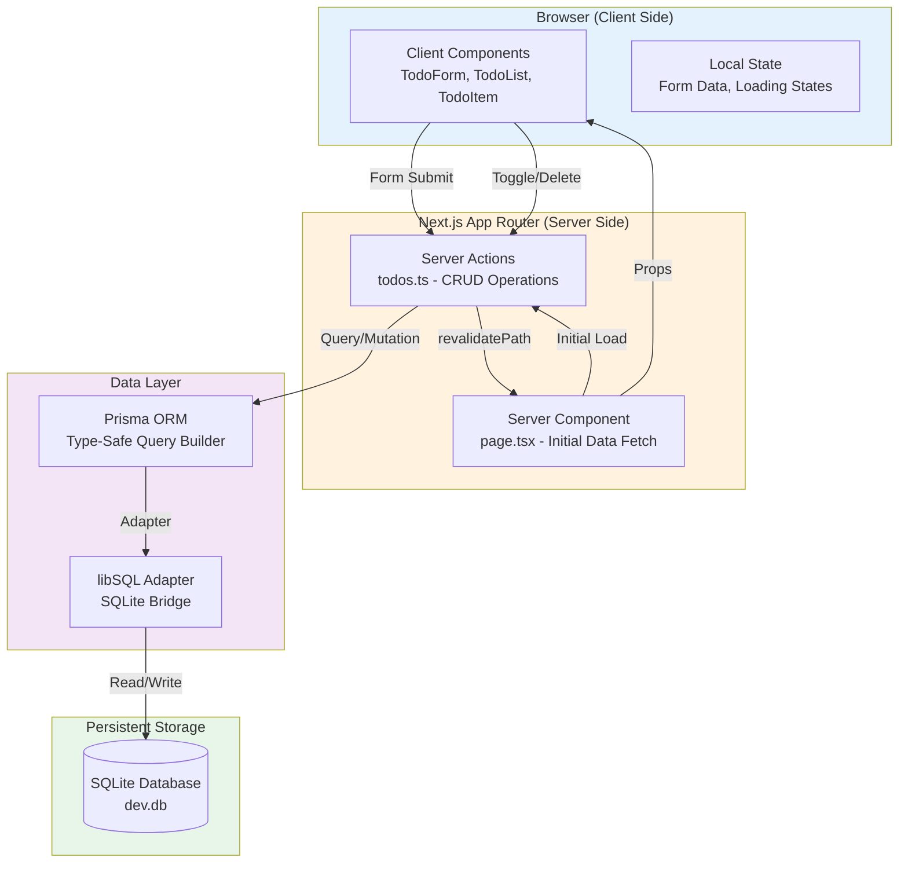
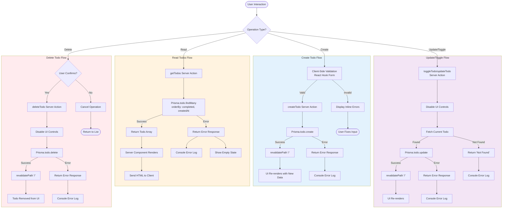
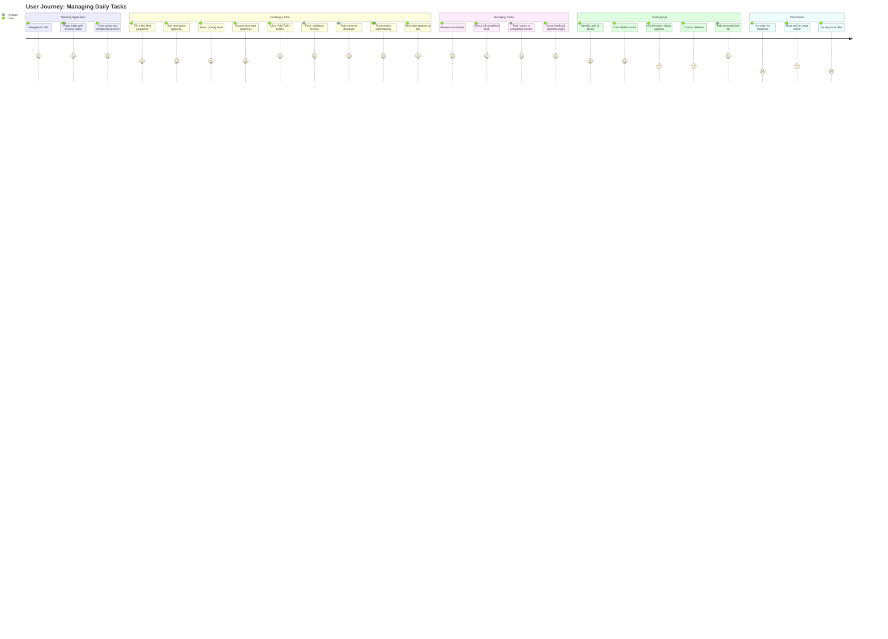
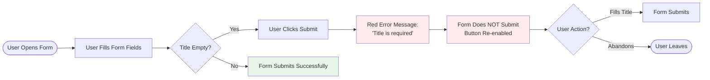
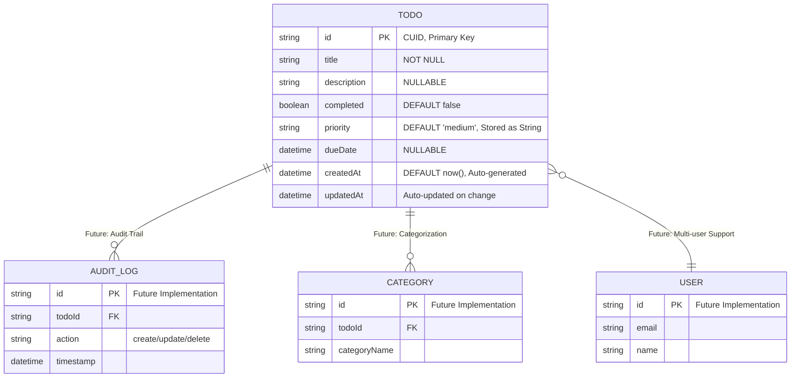
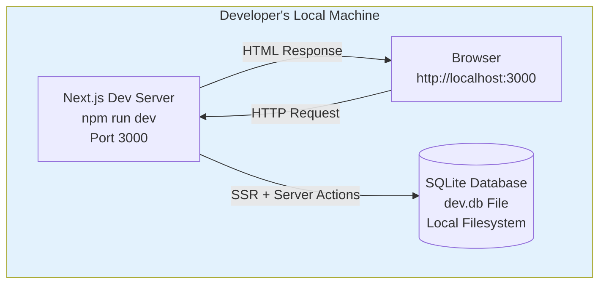
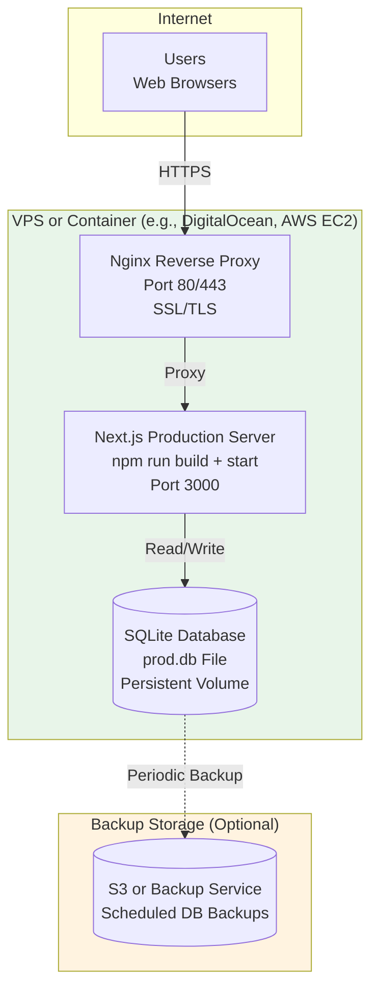
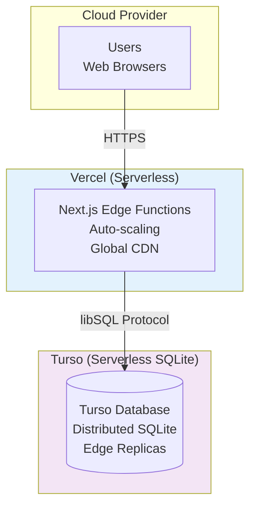
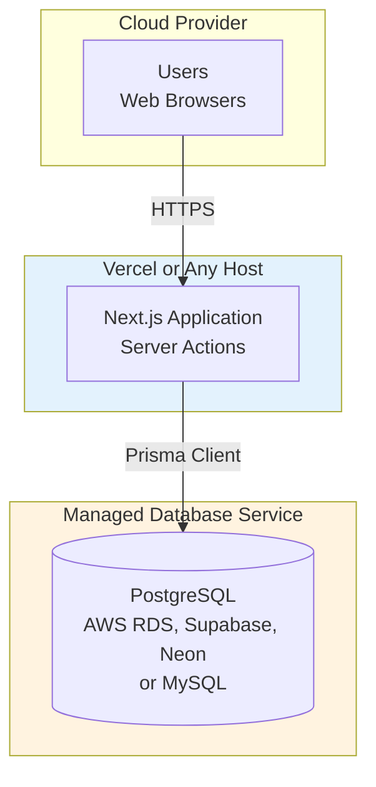
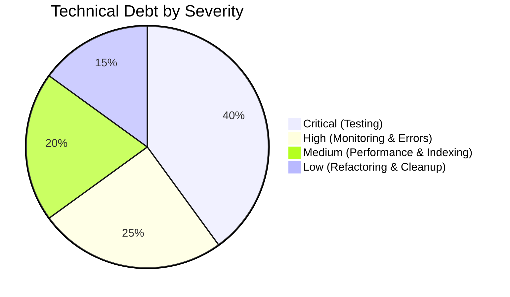

# Visual Diagrams: Todo List Application

**Document Version:** 1.0
**Last Updated:** 2026-01-15
**Status:** Complete
**Created By:** Business Analyst
**Purpose:** Comprehensive visual documentation of application architecture, flows, and structure

---

## Table of Contents

1. [System Architecture Diagram](#1-system-architecture-diagram)
2. [Data Flow Diagram](#2-data-flow-diagram)
3. [Component Hierarchy Diagram](#3-component-hierarchy-diagram)
4. [User Journey Map](#4-user-journey-map)
5. [Database Schema Diagram](#5-database-schema-diagram)
6. [Deployment Architecture Diagram](#6-deployment-architecture-diagram)

---

## 1. System Architecture Diagram

### Overview
This diagram shows the high-level architecture of the todo application, illustrating the separation between client and server components, the data layer, and how they interact.

### Architecture Layers



### Key Architectural Decisions

**Client vs Server Split:**
- **Server Components:** page.tsx performs initial data fetching via SSR
- **Client Components:** TodoForm, TodoList, TodoItem handle interactivity
- **Server Actions:** Handle all mutations (create, update, delete, toggle)

**Data Flow Pattern:**
- User interactions trigger Server Actions
- Server Actions call Prisma ORM
- After mutations, `revalidatePath('/')` triggers re-render
- Entire page re-fetches and updates

**State Management:**
- Minimal client-side state (form data, loading states)
- Server is source of truth via Next.js cache revalidation
- No global state management library needed

---

## 2. Data Flow Diagram

### Overview
This diagram shows the complete data flow for all CRUD operations, including validation, error handling, and revalidation paths.

### CRUD Operations Flow



### Error Handling Strategy

**Current Implementation:**
- Try-catch blocks in all Server Actions
- Errors logged to console
- Generic error messages returned to client
- No retry logic
- No user-facing error notifications (no toast system)

**Data Validation:**
- Client-side: React Hook Form validates required fields
- Server-side: No validation currently (priority values not checked)
- Database-level: SQLite constraints (NOT NULL on required fields)

---

## 3. Component Hierarchy Diagram

### Overview
This diagram shows the component tree, prop flow, and the boundary between Server and Client Components.

### Component Structure

```mermaid
graph TD
    subgraph ServerSide["Server Components (SSR)"]
        Page[page.tsx<br/>Server Component]
    end

    subgraph ClientSide["Client Components (Browser)"]
        Form[TodoForm<br/>'use client']
        List[TodoList<br/>'use client']
        Item1[TodoItem]
        Item2[TodoItem]
        ItemN[TodoItem...]
    end

    subgraph ServerActions["Server Actions"]
        GetTodos[getTodos]
        CreateTodo[createTodo]
        UpdateTodo[updateTodo]
        DeleteTodo[deleteTodo]
        ToggleTodo[toggleTodo]
    end

    subgraph FormLib["React Hook Form"]
        FormState[Form State<br/>register, handleSubmit, errors]
    end

    Page -->|await getTodos| GetTodos
    GetTodos -->|returns Todo[]| Page
    Page -->|props: todos| List
    Page --> Form

    List -->|filter active| Item1
    List -->|filter completed| Item2
    List --> ItemN

    List -->|props: todo| Item1
    List -->|props: todo| Item2
    List -->|props: todo| ItemN

    Form --> FormState
    FormState -->|onSubmit| CreateTodo

    Item1 -->|onChange| ToggleTodo
    Item1 -->|onClick| DeleteTodo
    Item2 -->|onChange| ToggleTodo
    Item2 -->|onClick| DeleteTodo
    ItemN -->|onChange| ToggleTodo
    ItemN -->|onClick| DeleteTodo

    CreateTodo -.->|revalidatePath| Page
    UpdateTodo -.->|revalidatePath| Page
    DeleteTodo -.->|revalidatePath| Page
    ToggleTodo -.->|revalidatePath| Page

    style ServerSide fill:#fff3e0
    style ClientSide fill:#e3f2fd
    style ServerActions fill:#f3e5f5
    style FormLib fill:#e8f5e9
```

### Props and State Flow

| Component | Type | Props | State | Server Actions Called |
|-----------|------|-------|-------|----------------------|
| **page.tsx** | Server | None | N/A | getTodos (SSR) |
| **TodoForm** | Client | None | isLoading | createTodo |
| **TodoList** | Client | todos: Todo[] | None | None (display only) |
| **TodoItem** | Client | todo: Todo | isLoading | toggleTodo, deleteTodo |

### Component Responsibilities

**page.tsx (Server Component):**
- Fetches initial todo data via `getTodos()`
- Renders layout and structure
- Passes data to client components as props

**TodoForm (Client Component):**
- Manages form state with React Hook Form
- Validates user input (title required)
- Calls `createTodo` server action on submit
- Shows loading state during submission
- Resets form after successful creation

**TodoList (Client Component):**
- Receives todos array as prop
- Filters todos into active/completed sections
- Conditionally renders section headers
- Shows empty state when no todos exist
- Maps todo data to TodoItem components

**TodoItem (Client Component):**
- Displays individual todo information
- Handles checkbox toggle (completion status)
- Handles delete button with confirmation
- Shows loading state during actions
- Applies visual styling based on completion status

---

## 4. User Journey Map

### Overview
This journey map shows the complete user experience from opening the app to managing todos, including decision points, pain points, and success paths.

### Primary User Journey



### Alternative Flow: Validation Error



### Key Decision Points

1. **Create Todo - Priority Selection**
   - Low: Blue badge, no urgency
   - Medium: Amber badge (default), normal priority
   - High: Red badge, requires immediate attention

2. **Complete Todo - Toggle Checkbox**
   - Checked: Moves to "Completed" section, strikethrough text, muted colors
   - Unchecked: Returns to "Active Tasks" section, normal styling

3. **Delete Todo - Confirmation**
   - Confirm: Todo permanently deleted (no undo)
   - Cancel: Returns to list unchanged

### User Experience Highlights

**Positive Moments:**
- Instant visual feedback on form submission ("Adding..." state)
- Clear separation of active vs completed tasks
- Color-coded priority badges for quick scanning
- Empty state guidance for new users
- Form auto-reset after successful creation

**Pain Points (Technical Debt):**
- Full page refresh on every action (not optimistic UI)
- No undo functionality
- Permanent deletion with only browser confirm
- No loading spinner (only button text change)
- No success/error toast notifications
- No keyboard shortcuts

---

## 5. Database Schema Diagram

### Overview
This diagram shows the current database structure, field types, constraints, and potential future relationships.

### Current Schema (SQLite)



### Field Details

| Field | Type | Constraints | Purpose | Notes |
|-------|------|-------------|---------|-------|
| **id** | String | PK, CUID | Unique identifier | Collision-resistant, better than UUID for distributed systems |
| **title** | String | NOT NULL | Task name/summary | Required field, validated client-side |
| **description** | String | NULLABLE | Extended details | Optional multi-line text |
| **completed** | Boolean | DEFAULT false | Completion status | Toggles between active/completed sections |
| **priority** | String | DEFAULT 'medium' | Urgency level | Should be ENUM but stored as string (no DB validation) |
| **dueDate** | DateTime | NULLABLE | Deadline | Optional, formatted for display |
| **createdAt** | DateTime | DEFAULT now() | Audit trail | Auto-generated on insert |
| **updatedAt** | DateTime | AUTO UPDATE | Audit trail | Auto-updated by Prisma |

### Schema Concerns (Technical Debt)

**1. Priority as String vs Enum**
- **Current:** `priority String @default("medium")`
- **Risk:** No database-level validation, could store invalid values like "urgent" or "critical"
- **Recommendation:** Change to enum or add check constraint
- **Impact:** Low (validated client-side currently)

**2. No Database Indexes**
- **Current:** No explicit indexes defined
- **Risk:** Slow queries when todo count grows (1000+ todos)
- **Recommendation:** Add indexes on:
  - `completed` (for filtering active vs completed)
  - `createdAt DESC` (for sorting)
  - Composite index on `(completed, createdAt)` for optimal queries
- **Impact:** Medium (affects performance at scale)

**3. Hard Delete (No Soft Delete)**
- **Current:** `deleteTodo` permanently removes records
- **Risk:** No undo, no recovery, no audit trail
- **Recommendation:** Add `deletedAt DateTime?` field for soft deletes
- **Impact:** Low (single-user app, no compliance requirements)

**4. CUID vs Auto-increment**
- **Current:** Uses CUID (Collision-Resistant Unique ID)
- **Rationale:** Future-proof for distributed systems
- **Alternative:** Integer auto-increment for simpler SQLite usage
- **Assessment:** CUID is overkill for single-user SQLite but not harmful

### Future Schema Extensions (v2.0)

**Categories/Projects:**
```prisma
model Category {
  id        String   @id @default(cuid())
  name      String   @unique
  color     String?
  todos     Todo[]
}

model Todo {
  // ... existing fields
  categoryId String?
  category   Category? @relation(fields: [categoryId], references: [id])
}
```

**Multi-User Support:**
```prisma
model User {
  id    String @id @default(cuid())
  email String @unique
  name  String
  todos Todo[]
}

model Todo {
  // ... existing fields
  userId String
  user   User @relation(fields: [userId], references: [id])
}
```

**Recurring Tasks:**
```prisma
model RecurrenceRule {
  id        String  @id @default(cuid())
  frequency String  // daily, weekly, monthly
  interval  Int     // every X days/weeks/months
  todoId    String  @unique
  todo      Todo    @relation(fields: [todoId], references: [id])
}
```

---

## 6. Deployment Architecture Diagram

### Overview
This diagram shows current development setup and proposed production deployment options, highlighting the SQLite limitations and alternatives.

### Current Development Architecture



### Production Deployment Options

#### Option 1: Traditional VPS/Container (Recommended)



**Pros:**
- SQLite works without changes
- Simple deployment
- Low cost (~$5-20/month)
- Full control

**Cons:**
- Single point of failure
- Manual scaling
- Requires server management

---

#### Option 2: Serverless with Turso (SQLite-compatible)



**Pros:**
- True serverless (zero ops)
- Global edge distribution
- Auto-scaling
- Minimal code changes (just connection string)

**Cons:**
- New dependency (Turso)
- Costs scale with usage
- Vendor lock-in

**Required Changes:**
- Update `DATABASE_URL` to Turso endpoint
- Install `@libsql/client` (already installed)
- No schema changes needed

---

#### Option 3: Migrate to PostgreSQL/MySQL (Major Change)



**Pros:**
- True production-grade database
- Better concurrency handling
- Rich feature set (JSON, full-text search, etc.)
- Wide hosting options

**Cons:**
- Requires database migration
- Schema changes needed (ENUM support, etc.)
- Higher complexity
- Higher cost

**Required Changes:**
- Change datasource provider in Prisma schema
- Generate new migration
- Update connection string
- Possibly adjust queries (SQLite quirks)

---

### Deployment Comparison Matrix

| Factor | VPS + SQLite | Serverless + Turso | PostgreSQL |
|--------|--------------|-------------------|------------|
| **Code Changes** | None | Minimal (env var) | Moderate (schema) |
| **Ops Complexity** | Medium (server mgmt) | Low (zero ops) | Low (managed DB) |
| **Scalability** | Vertical only | Automatic | Excellent |
| **Cost (low usage)** | $5-10/month | Free tier, then $29+ | $15-25/month |
| **Deployment Speed** | Days | Hours | Days |
| **SQLite Compatibility** | 100% | 99% (libSQL) | N/A (different DB) |
| **Backup Strategy** | Manual/Scripted | Built-in | Built-in |
| **Suitable for v1.0?** | Yes | Yes | Overkill |
| **Suitable for v2.0?** | Limited | Yes | Yes |

### Recommended Deployment Path

**For v1.0 (Current):**
1. Deploy to VPS (DigitalOcean, Linode, Railway)
2. Use existing SQLite database
3. Set up automated backups (cron + S3)
4. Add monitoring (Sentry, LogRocket)

**For v2.0 (Future - Multi-user/Cloud Sync):**
1. Migrate to Turso (easiest) or PostgreSQL (most robust)
2. Add authentication layer (NextAuth.js, Clerk, or Supabase Auth)
3. Update schema to include `userId` foreign key
4. Implement row-level security

### Deployment Blockers

**Current Architectural Limitations:**
1. SQLite file-based storage not suitable for serverless environments
2. No production build tested yet
3. No environment-specific configuration (dev vs prod)
4. No database migration strategy for production
5. No monitoring or observability setup
6. No backup/restore mechanism
7. No health check endpoints

---

## Diagram Usage Guide

### For Developers
- **System Architecture:** Understand high-level structure before coding
- **Data Flow:** Debug issues by tracing request flow
- **Component Hierarchy:** Know where to add new features

### For Product Managers
- **User Journey Map:** Identify UX improvement opportunities
- **Data Flow:** Understand performance implications of features

### For Stakeholders
- **Deployment Architecture:** Evaluate hosting costs and options
- **Database Schema:** Assess data model extensibility

### For QA Engineers
- **Data Flow Diagram:** Create test cases for each path
- **User Journey:** Design E2E test scenarios

---

## Technical Debt Visualization

### Architectural Debt Summary



### Priority Matrix

| Debt Item | Severity | Effort | Priority |
|-----------|----------|--------|----------|
| No Tests (Unit/Integration/E2E) | Critical | High | P0 - Must Fix |
| No Error Monitoring/Logging | High | Medium | P1 - Should Fix |
| No Database Indexes | Medium | Low | P1 - Should Fix |
| Full Page Revalidation (Performance) | Medium | High | P2 - Could Fix |
| Priority as String (Should be Enum) | Low | Low | P2 - Could Fix |
| No Toast Notifications | Low | Low | P3 - Nice to Have |
| No Undo Functionality | Low | Medium | P3 - Nice to Have |

---

## Conclusion

This visual documentation provides a comprehensive view of the todo application's architecture, data flows, and structure. Key takeaways:

**Strengths:**
- Clean separation of concerns (Server Components vs Client Components)
- Type-safe data layer with Prisma
- Simple, understandable architecture
- Modern React 19 and Next.js 16 patterns

**Weaknesses:**
- No tests (critical gap)
- SQLite limits deployment options
- Full page revalidation impacts performance
- Minimal error handling and user feedback

**Next Steps:**
1. Implement testing infrastructure (Story 6.1)
2. Add database indexes for performance
3. Choose deployment target and adapt accordingly
4. Implement monitoring and error tracking

**Recommendation:** The current architecture is suitable for v1.0 as a single-user application but will require refactoring for v2.0 features (multi-user, cloud sync). Consider deployment target early to avoid costly migrations.

---

**Document Status:** Complete - Ready for review by Product Manager and System Architect
**Related Documents:**
- `/Users/tadeumarques/Coding/tadeu-todo-app/docs/PRD-TodoApp.md`
- `/Users/tadeumarques/Coding/tadeu-todo-app/docs/USER-STORIES-TodoApp.md`
- `/Users/tadeumarques/Coding/tadeu-todo-app/docs/ARCHITECTURE-REVIEW-REQUEST.md`
